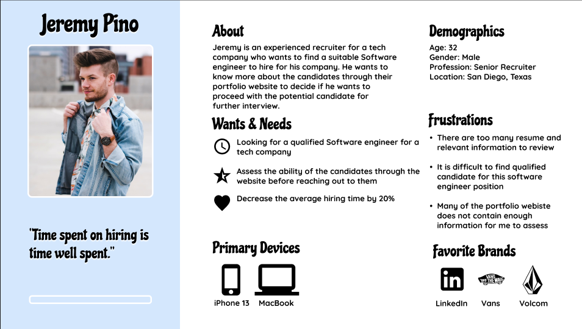
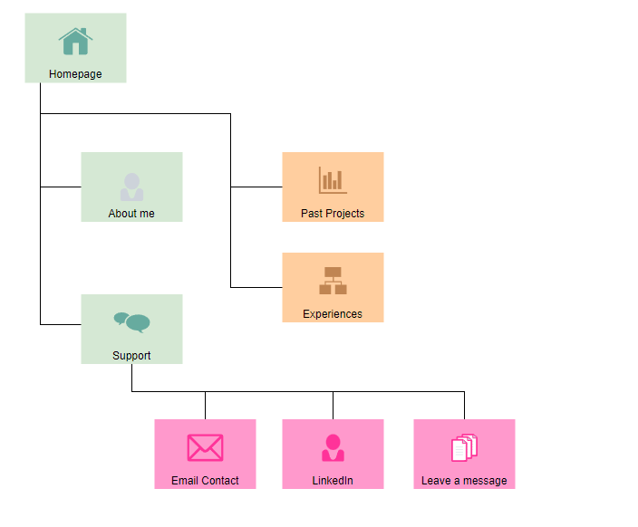
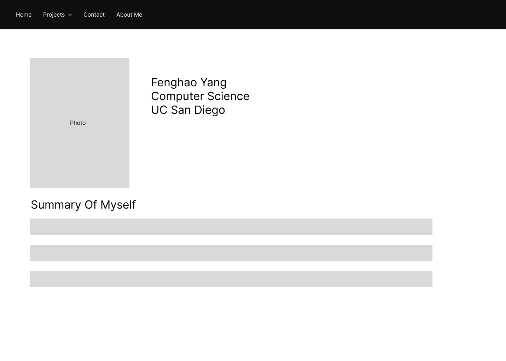
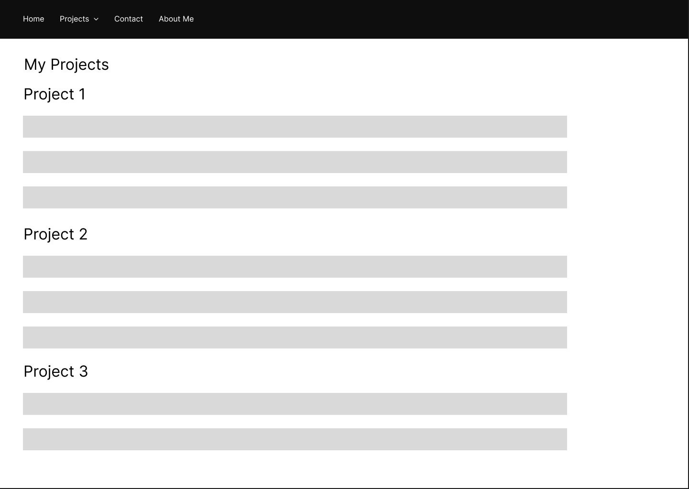

# Fenghao Yang Portfolio
Welcome to my portfolio website! My name is Fenghao Yang and I am a fourth year computer science student at UCSD. This portfolio website is designed to showcase my works and past experiences in order to give the potential recruiters a bettern understanding of my skills and experiences. This might help me to find more opportunities in the job market. 

## Persona Diagram

## Site Diagram

## Wireframe
### homepage

### project page

## Technical Requirement
For this website, I will mainly use HTML/CSS to build and will add some javascript function to add some functionality to my portfolio website. The main target browser will be chrome but the website will be compatible to most of other browsers such as Edge and Firefox. The target device will be desktop and laptop but the users can definitely visit the webiste using mobile devices. In the future, I will make the website fully compatible with the mobile devices. The website will be host on netify.

## Content Requirements
This portfolio website will mainly include my personal information. I will add a projects/experiences tab to display my past projects that I have did as a software engineer. I will add a skill section to showcases my abilities and skills. In addition, there will be a contact section where viewer can find my contact information. 

## Link to the website
https://fenghao-yang-portfolio.netlify.app/